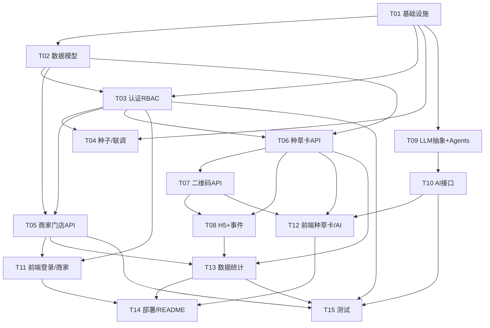

# AI 本地商家增长 SaaS 系统 — 开发任务拆解（MVP）

> 拆解人：高见远（架构师）｜依据：技术评审 `docs/01-技术评审.md` + 产品经理 MVP 范围确认
> 已采纳决策（D1–D4）：D1 默认 SQLite、生产 `DATABASE_URL` 切 PG、MVP 不引入 Redis；D2 NFC 仅数据建模+二维码主路径、写卡硬件延后；D3 AI 只生成/建议、不自动发布视频号；D4 agent 角色仅预留不实现。
> 目标：7 天可真实服务商家的 MVP。本文件只做拆解与设计（接口契约、文件清单、任务顺序），不含实现代码。

---

## 1. 最终技术栈定稿

直接引用技术评审结论（D1–D4），不重复论证。

| 层 | 落地选型 |
|---|---|
| 后端 | FastAPI 0.111+（异步 ASGI） + SQLAlchemy 2.0（异步 ORM） + Pydantic v2 + PyJWT + bcrypt（直接用，不用 passlib[bcrypt]） + python-dotenv + segno + httpx + python-multipart |
| 数据 | **SQLite 默认**（`sqlite+aiosqlite:///./app.db`）；生产经 `DATABASE_URL` 切 PostgreSQL（`postgresql+asyncpg://...`）。**MVP 不引入 Redis**。会话用 JWT（无状态）。软删除用 `status` 字段 |
| 前端 | React 18 + Vite 5.4+/6 + Tailwind 3 + react-router-dom 6 + axios；**手写 Shadcn 风格组件**（不执行 `npx shadcn` CLI，规避联网）。构建产物 `frontend/dist` 由 FastAPI 静态托管 |
| 消费者端 | 纯 H5 静态页（`h5/`），由 FastAPI 直接 serve；事件上报走 `POST /api/seed-card/event` |
| AI | `LLMProvider` 抽象 + **`MockProvider` 离线兜底（默认）** + OpenAI/DeepSeek Provider（httpx 异步）。`ai_task` 必须落库（pending→running→done/failed） |
| 部署 | MVP 单 `uvicorn` 全量运行（API + 后台静态页 + H5）；`docker-compose.yml` 作为**可选**产物（PG/Redis 默认注释） |

**统一返回结构**：`{ "code": 0, "message": "ok", "data": {} }`。`code`：0 成功；401 未认证；403 无权限；404 不存在；422 参数错误；429 限流；500 服务器错误。列表类 `data` 含 `items` 与 `total`。

---

## 2. 模块与文件清单

所有路径相对项目根 `D:\桌面\AI-local\AI-Local-Growth-SaaS\`。

### 2.1 后端（`backend/`）

```
backend/
├── main.py                     # FastAPI 实例：CORS、挂载 /api 路由、托管 frontend/dist、/c/{slug} 与 /h5、startup create_all
├── config.py                   # pydantic-settings / env 加载：DATABASE_URL, LLM_PROVIDER, LLM_API_KEY, LLM_BASE_URL, JWT_SECRET, JWT_EXPIRE, CORS_ORIGINS
├── requirements.txt            # 后端依赖（锁大版本）
├── .env.example                # 环境变量样例（入仓；真实 .env 不入库）
├── seed_admin.py               # 初始化管理员脚本（T04 产出）
├── app/
│   ├── __init__.py
│   ├── database/
│   │   ├── __init__.py         # async_engine, async_sessionmaker, Base, get_db 依赖
│   │   └── base.py             # Declarative Base + SoftDeleteMixin（status 字段、soft_delete()）
│   ├── models/                 # 7 张表 ORM（T02）
│   │   ├── sys_user.py         # id,username,password_hash,role,merchant_id,status,created_at
│   │   ├── merchant_info.py    # id,name,industry,address,contact,phone,package,expire_time,status
│   │   ├── store_info.py       # id,merchant_id,name,location,video_account,poi_status,status
│   │   ├── seed_card.py        # id,merchant_id,name,slug,type[NFC/二维码],target_type[video/private/custom],target_url,nfc_id,qr_code,status
│   │   ├── seed_event.py       # id,card_id,event_type[scan/click/share/comment],device,referer,created_at
│   │   ├── video_content.py    # id,merchant_id,title,url,category,created_at,status
│   │   └── ai_task.py          # id,agent_type,input,output,status,created_at
│   ├── schemas/                # Pydantic v2 请求/响应模型（按模块）
│   │   ├── auth.py             # LoginIn, TokenOut, ProfileOut
│   │   ├── merchant.py         # MerchantCreate, MerchantUpdate, MerchantOut, StoreIn, StoreOut
│   │   ├── seed_card.py        # SeedCardCreate, SeedCardOut, SeedEventIn
│   │   ├── ai.py               # CommentIn, CommentOut, ReportIn, ReportOut, ContentIn, ContentOut
│   │   └── stats.py            # StatsOverviewOut
│   ├── api/                    # 路由（T03/T05/T06/T07/T08/T10/T13）
│   │   ├── auth.py             # POST /api/auth/login, GET /api/user/profile
│   │   ├── merchant.py         # 商家+门店 CRUD（含软删/禁用/RBAC）
│   │   ├── seed_card.py        # 种草卡 CRUD, /qrcode, /event
│   │   ├── ai.py               # /api/ai/comment, /api/ai/report, /api/ai/content
│   │   ├── stats.py            # GET /api/stats/overview
│   │   └── h5.py               # GET /c/{slug} 返回 H5 落地页
│   ├── services/               # 业务逻辑（T05/T06/T13）
│   │   ├── auth_service.py     # 登录校验、JWT 签发、RBAC 作用域
│   │   ├── merchant_service.py # 商家/门店 CRUD + 软删 + merchant_id 作用域
│   │   ├── seed_card_service.py# 创建(生成 slug/qr)、事件写入
│   │   └── stats_service.py    # 聚合 seed_event / 商家 / 种草卡
│   ├── agents/                 # AI 层（T09/T10）
│   │   ├── provider.py         # LLMProvider(ABC) + get_provider()（读 LLM_PROVIDER，缺省 mock）
│   │   ├── mock.py             # MockProvider（模板+变量替换，离线）
│   │   ├── openai_provider.py  # OpenAIProvider（httpx）
│   │   ├── deepseek_provider.py# DeepSeekProvider（httpx，推荐真实后端）
│   │   ├── base.py             # Agent(ABC)：build_prompt / run（含 ai_task 落库）
│   │   ├── diagnosis.py        # DiagnosisAgent（POST /api/ai/report）
│   │   ├── comment.py          # CommentAgent（POST /api/ai/comment）
│   │   └── content.py          # ContentAgent（POST /api/ai/content，写 video_content）
│   ├── utils/
│   │   ├── security.py         # bcrypt 哈希/校验、JWT 签发/解析
│   │   ├── rbac.py             # get_current_user 依赖、require_role 装饰
│   │   ├── qrcode.py           # segno 生成 PNG/SVG（返回字节或 data URI）
│   │   ├── slug.py             # 生成唯一短 slug（短 UUID/可读码，查重）
│   │   ├── response.py         # 统一 {code,message,data} 响应封装 + 错误码
│   │   └── client.py           # UA 解析（device 字段）、referer 提取
│   └── tests/                  # pytest + pytest-asyncio（T15）
│       ├── conftest.py         # 测试库（SQLite 内存/临时文件）、测试 client、固定 admin token
│       ├── test_auth.py
│       ├── test_merchant.py
│       ├── test_seed_card.py
│       ├── test_ai.py
│       └── test_stats.py
```

### 2.2 前端（`frontend/`）

```
frontend/
├── package.json                # react, react-dom, vite, @vitejs/plugin-react, tailwindcss, postcss, autoprefixer, react-router-dom, axios（+可选 zustand）
├── vite.config.ts              # React 插件；build.outDir=dist；dev proxy /api → backend
├── tailwind.config.js          # content globs；主题色（品牌色）
├── postcss.config.js
├── tsconfig.json / tsconfig.node.json
├── index.html
├── .env                        # VITE_API_BASE=/api
└── src/
    ├── main.tsx                # 挂载 App，Router
    ├── App.tsx                 # 路由表（/login, /dashboard, /merchants, /seed-cards, /ai/*）
    ├── index.css               # Tailwind 指令
    ├── api/
    │   ├── http.ts             # axios 实例（baseURL=VITE_API_BASE，统一解包 {code,message,data}，401 跳登录）
    │   ├── auth.ts             # login, getProfile
    │   ├── merchant.ts         # CRUD
    │   ├── seedCard.ts         # create, list, get, qrcode(blob)
    │   ├── ai.ts               # comment, report, content
    │   └── stats.ts            # overview
    ├── hooks/
    │   ├── useAuth.ts          # 登录态、token 存取、当前用户/角色
    │   ├── useMerchants.ts
    │   └── useSeedCards.ts
    ├── components/
    │   ├── ui/                 # 手写 Shadcn 风格：button.tsx, card.tsx, input.tsx, textarea.tsx, dialog.tsx, table.tsx, select.tsx, badge.tsx, label.tsx
    │   └── layout/             # AppLayout.tsx（侧边栏+顶栏，按 role 显隐菜单）, Sidebar.tsx, Topbar.tsx
    ├── pages/
    │   ├── Login.tsx
    │   ├── Dashboard.tsx       # 数据概览（T13）
    │   ├── Merchants.tsx       # 列表/搜索/禁用/软删
    │   ├── MerchantDetail.tsx  # 详情/编辑 + 门店列表
    │   ├── SeedCards.tsx       # 种草卡列表
    │   ├── SeedCardCreate.tsx  # 创建（类型/跳转目标）
    │   ├── SeedCardDetail.tsx  # 详情 + 二维码下载 + 事件统计
    │   ├── AIReport.tsx        # 诊断报告
    │   ├── AIComment.tsx       # 评论生成
    │   └── AIContent.tsx       # 脚本/文案生成
    └── utils/
        └── cn.ts               # className 合并（clsx + tailwind-merge）
```

### 2.3 消费者端 H5（`h5/`）

```
h5/
├── index.html                  # 种草卡落地页模板（读 URL /c/{slug}，拉取卡片信息+跳转目标，触发 scan 事件）
└── assets/
    ├── app.js                  # 解析 slug、GET 卡片信息、上报 scan、点击/分享/评论按钮上报对应事件、跳转 target_url
    └── style.css
```

### 2.4 部署与文档（`docker/` `docs/` 根）

```
docker/
├── Dockerfile                  # 可选：多阶段构建（前端 build + 后端 uvicorn）
├── docker-compose.yml          # 可选：app +（注释的 PG）+（注释的 Redis）
└── .dockerignore
scripts/
└── start.sh                    # uvicorn main:app --host 0.0.0.0 --port 8000（--reload 开发）
.env.example                    # 根级样例
README.md                       # 启动/配置/接口说明（T14）
docs/
├── 01-技术评审.md
├── 02-MVP范围.md               # 产品经理产出（引用）
└── 03-任务拆解.md              # 本文
```

---

## 3. 开发任务列表（15 个有序任务）

> 优先级：P0 = MVP 必做；P1 = MVP 内但低于核心链路（可被时间压力裁剪）。预计文件仅列主产物。

| ID | 模块 | 名称 | 输入 | 输出（文件/接口/表） | 依赖 | 优先级 | 天 | 预计文件 |
|---|---|---|---|---|---|---|---|---|
| T01 | 基础设施 | 项目脚手架与全局配置 | D1–D4 决策 | `backend/main.py`、`config.py`、`requirements.txt`、`.env.example`、`database/__init__.py`、`utils/response.py`、`scripts/start.sh`；启动可返回 200 健康检查 | — | P0 | Day1 | main.py, config.py, database/__init__.py, utils/response.py |
| T02 | 数据层 | ORM 模型与软删除基类 | 7 张表结构（PRD-04 §5） | 7 个 model 文件 + `SoftDeleteMixin`；`Base.metadata.create_all` 可建表 | T01 | P0 | Day1 | models/*.py, database/base.py |
| T03 | 用户系统 | 认证与 RBAC 核心 | sys_user；角色枚举 | `POST /api/auth/login`、`GET /api/user/profile`；`get_current_user`、`require_role`；密码哈希+JWT | T01,T02 | P0 | Day1 | api/auth.py, services/auth_service.py, utils/security.py, utils/rbac.py, schemas/auth.py |
| T04 | 用户系统 | 管理员种子与登录联调 | admin 初始账号 | `seed_admin.py`（创建 admin）；OpenAPI/curl 登录拿到 token | T03 | P0 | Day1 | seed_admin.py |
| T05 | 商家管理 | 商家与门店 CRUD API | MVP#2/#3 | `POST/GET/PUT /api/merchant/*`、`store` 子路由；软删/禁用；`merchant_id` 作用域 | T02,T03 | P0 | Day2 | api/merchant.py, services/merchant_service.py, schemas/merchant.py |
| T06 | 种草卡 | 种草卡创建与跳转目标 API | MVP#5/#6 | `POST /api/seed-card/create`（生成 slug+target）、`GET /api/seed-card/{id}`、`GET /api/seed-card/list` | T02,T03 | P0 | Day3 | api/seed_card.py, services/seed_card_service.py, utils/slug.py, schemas/seed_card.py |
| T07 | 种草卡 | 二维码生成与下载 API | MVP#7；segno | `GET /api/seed-card/{id}/qrcode`（image/png） | T06 | P0 | Day3 | utils/qrcode.py（接入 seed_card.py） |
| T08 | 消费者端 | 扫码 H5 落地页 + 事件追踪 | MVP#8 | `GET /c/{slug}`（返回 `h5/index.html`）；`POST /api/seed-card/event`（写 seed_event）；`h5/` 三文件 | T06,T07 | P0 | Day3 | api/h5.py, api/seed_card.py(event), h5/index.html, h5/assets/app.js, h5/assets/style.css, utils/client.py |
| T09 | AI 层 | LLM Provider 抽象 + Mock + 三 Agent | 评审 1.4 | `provider.py`+`get_provider()`、`mock/openai/deepseek`、`base.py`+`diagnosis/comment/content` Agent；Mock 离线可跑 | T01 | P0 | Day4 | app/agents/*.py |
| T10 | AI 层 | AI 评论/内容/诊断 API（ai_task 落库） | MVP#4/#10/#11 | `POST /api/ai/comment`、`POST /api/ai/report`、`POST /api/ai/content`；均写 `ai_task` | T09 | P0 | Day4 | api/ai.py, schemas/ai.py |
| T11 | 后台前端 | 登录/布局/商家门店页 | T03,T05 | `Login`、`AppLayout/Sidebar`、`Merchants`、`MerchantDetail`；axios 封装 | T03,T05 | P0 | Day5 | src/api/http.ts, src/api/auth.ts, src/api/merchant.ts, src/pages/Login.tsx, src/components/layout/*, src/pages/Merchants.tsx, src/pages/MerchantDetail.tsx, src/components/ui/* |
| T12 | 后台前端 | 种草卡/二维码/AI 页 | T06,T07,T10 | `SeedCards`、`SeedCardCreate`、`SeedCardDetail`(含二维码下载)、`AIReport`、`AIComment`、`AIContent` | T06,T07,T10 | P0 | Day5 | src/api/seedCard.ts, src/api/ai.ts, src/pages/SeedCards.tsx, SeedCardCreate.tsx, SeedCardDetail.tsx, AIReport.tsx, AIComment.tsx, AIContent.tsx |
| T13 | 数据统计 | 统计服务 + Dashboard | MVP#9 | `GET /api/stats/overview`；`Dashboard` 页；聚合 seed_event | T05,T06,T08 | P1 | Day6 | services/stats_service.py, api/stats.py, schemas/stats.py, src/api/stats.ts, src/pages/Dashboard.tsx |
| T14 | 部署 | 启动脚本/docker/README | 全部 | `README.md`、`docker/`(可选)、`scripts/start.sh` 校验；一键启动说明 | T11,T12,T13 | P0 | Day7 | README.md, docker/*, scripts/start.sh |
| T15 | 测试 | 单元与接口测试 | T03–T13 | `tests/*`：auth/merchant/seed_card/ai/stats 用例（PRD 强制：含软删、RBAC 越权、Mock AI、seed_event 聚合） | T03,T05,T10,T13 | P0 | Day7 | tests/*.py |

> 说明：`video_content` 表在 T02 建好；其写入由 T10 的 `ContentAgent` 完成（生成脚本落 `video_content`），无需单独任务。NFC 仅建 `nfc_id` 字段（T06）与数据模型，写卡硬件验证延后（D2）。`agent` 角色在 T03 枚举与鉴权链预留，具体逻辑延后（D4）。

---

## 4. 依赖关系图



**关键依赖解读**：
- H5 落地页（T08）依赖种草卡创建（T06）与二维码（T07）：必须先有 slug 与二维码资源。
- 统计（T13）依赖 seed_event（T08）、商家（T05）、种草卡（T06）均有数据后才能聚合。
- 前端页面（T11/T12）严格依赖对应后端 API（T03/T05/T06/T07/T10）；后端先于前端完成，前端用 Mock/联调数据驱动。
- 测试（T15）横切，依赖各业务 API 完成后补充用例。
- AI 全部接口（T10）依赖 Provider 抽象（T09），Mock 兜底保证无 Key 也能测。

---

## 5. 关键接口契约

统一结构：`{ "code": 0, "message": "ok", "data": {...} }`。下列 `data` 为各接口 `data` 字段内容。

### 5.1 认证
**POST `/api/auth/login`**
- 入：`{ "username": string, "password": string }`
- 出：`{ "token": string, "token_type": "bearer", "user": { "id": int, "username": string, "role": "admin|merchant|agent", "merchant_id": int|null } }`
- 失败：`401`（用户名/密码错误）

**GET `/api/user/profile`**（需 Bearer Token）
- 出：`{ "id": int, "username": string, "role": string, "merchant_id": int|null, "status": string, "created_at": string }`

### 5.2 商家与门店
**POST `/api/merchant/create`**（admin 或 merchant）
- 入：`{ "name": string, "industry": string, "address": string, "contact": string, "phone": string, "package": string?, "expire_time": string?, "stores": [ { "name": string, "location": string, "video_account": string, "poi_status": string? } ] }`
- 出：`{ "id": int, "name": string, "industry": string, "status": "active", "stores": [ { "id": int, "name": string, "video_account": string } ] }`

**GET `/api/merchant/list`**（Auth；query：`page=1`,`size=20`,`keyword?`）
- 出：`{ "items": [ { "id": int, "name": string, "industry": string, "status": string, "store_count": int } ], "total": int }`

**GET `/api/merchant/{id}`**（Auth + RBAC：merchant 仅自己）
- 出：`{ "id": int, "name": string, "industry": string, "address": string, "contact": string, "phone": string, "package": string, "expire_time": string, "status": string, "stores": [ StoreOut ] }`

**PUT `/api/merchant/{id}`**（Auth + RBAC）
- 入：可编辑字段子集（`name`,`industry`,`address`,`contact`,`phone`,`package`,`expire_time`,`status`）
- 出：更新后的 MerchantOut

**POST `/api/merchant/{id}/disable`**（admin）
- 入：`{ "disabled": bool }`
- 出：`{ "id": int, "status": "disabled|active" }`

**DELETE `/api/merchant/{id}`**（admin，软删除）
- 出：`{ "id": int, "status": "deleted" }`

**门店子路由**：`POST /api/merchant/{id}/store`、`PUT /api/store/{id}`、`DELETE /api/store/{id}`（软删）
- StoreIn：`{ "name": string, "location": string, "video_account": string, "poi_status": string? }`
- StoreOut：`{ "id": int, "merchant_id": int, "name": string, "location": string, "video_account": string, "poi_status": string, "status": string }`

### 5.3 种草卡
**POST `/api/seed-card/create`**（Auth）
- 入：`{ "merchant_id": int, "name": string, "type": "NFC|二维码", "target_type": "video|private|custom", "target_url": string, "nfc_id": string? }`
- 出：`{ "id": int, "slug": string, "name": string, "type": string, "target_type": string, "target_url": string, "qr_code": string, "status": "active" }`（`qr_code` 为 data URI 或下载地址；`slug` 唯一）

**GET `/api/seed-card/{id}`**（Auth）
- 出：SeedCardOut 详情（含 slug、target、qr_code、status）

**GET `/api/seed-card/list`**（Auth；query：`page`,`size`,`merchant_id?`）
- 出：`{ "items": [ SeedCardSummary ], "total": int }`

**GET `/api/seed-card/{id}/qrcode`**（Auth）
- 出：`image/png`（二进制；`Content-Type: image/png`），为 segno 生成的该卡二维码

**POST `/api/seed-card/event`**（公开，来自 H5；不要求 Token）
- 入：`{ "card_id": int, "event_type": "scan|click|share|comment", "device": string?, "referer": string? }`
- 出：`{ "ok": true, "event_id": int }`

### 5.4 AI
**POST `/api/ai/comment`**（Auth）
- 入：`{ "video": string, "industry": string }`（`video` 为视频链接或描述文本）
- 出：`{ "comments": [ string ], "task_id": int }`

**POST `/api/ai/report`**（Auth）
- 入：`{ "merchant_id": int, "store_id": int? }`
- 出：`{ "report": { "score": int, "summary": string, "items": [ { "dimension": string, "finding": string, "suggestion": string } ] }, "task_id": int }`

**POST `/api/ai/content`**（Auth）
- 入：`{ "type": "script|copy", "industry": string, "topic": string, "tone": string? }`
- 出：`{ "content": string, "task_id": int }`（同时写 `video_content` 一行，`category=type`）

> 三个 AI 接口在无 `LLM_API_KEY` 时由 `MockProvider` 返回模板化结果；调用均落 `ai_task`（`agent_type`,`input`,`output`,`status`）。

### 5.5 统计
**GET `/api/stats/overview`**（Auth；query：`merchant_id?`，admin 可不传看全部）
- 出：`{ "merchant_count": int, "store_count": int, "card_count": int, "scan_total": int, "click_total": int, "share_total": int, "comment_total": int, "recent_events": [ { "card_id": int, "event_type": string, "created_at": string } ] }`

---

## 6. 实现顺序与里程碑（7 个 Sprint 的 DoD）

### Day 1 — 基础设施 + 用户系统（T01–T04）
- **DoD**：`uvicorn` 可启动；`/docs` 可用；`Base.metadata.create_all` 建出 7 张表（status 字段就位）；`seed_admin.py` 创建 admin；`POST /api/auth/login` 返回 token；`GET /api/user/profile` 经 Token 返回用户信息；RBAC 依赖 `get_current_user`/`require_role` 可用；统一 `{code,message,data}` 响应封装生效。
- **验收**：curl 登录→拿 token→带 token 调 profile 成功；错误密码返回 401；无 token 返回 401。

### Day 2 — 商家管理（T05）
- **DoD**：商家 CRUD + 门店 CRUD 全通；禁用/软删仅置 `status`（无物理 DELETE）；列表查询带 `merchant_id` 作用域（merchant 只能看自己）；admin 全量。
- **验收**：admin 创建商家+门店成功；merchant 登录后只能看到自己 `merchant_id` 数据；软删后列表不出现、详情不可达（404）。

### Day 3 — 种草卡 + 二维码 + H5（T06–T08）
- **DoD**：种草卡创建生成唯一 `slug` 与 `qr_code`；`GET /api/seed-card/{id}/qrcode` 返回 PNG；`GET /c/{slug}` 返回 H5 落地页；打开落地页触发 `scan` 事件并写入 `seed_event`；点击/分享/评论按钮上报对应事件。
- **验收**：创建卡片→下载二维码→手机扫码（或浏览器开 `/c/{slug}`）→`seed_event` 出现 scan 记录；点击跳转 `target_url` 并产生 click。

### Day 4 — AI 评论 / 内容 / 诊断（T09–T10）
- **DoD**：`LLMProvider` 抽象 + `get_provider()`（默认 mock）；`MockProvider` 离线产出评论/诊断/脚本；三个 API 落 `ai_task`；配置真实 Key 后可切换 OpenAI/DeepSeek。
- **验收**：无 Key 调三个接口均返回结构化结果且 `ai_task.status=done`；故意置错误 Key 时 `status=failed` 且不影响系统；诊断报告含 score+items。

### Day 5 — 后台前端页面（T11–T12）
- **DoD**：登录页 + 布局（按 role 显隐菜单）；商家/门店管理页（列表/详情/编辑/禁用/软删）；种草卡列表/创建/详情（二维码下载）；AI 评论/诊断/内容页；axios 统一解包与 401 跳转。
- **验收**：登录后进入后台；各页调通对应 API 并正确渲染；二维码可下载；AI 页展示 Mock 结果。前端 `npm run build` 产物可被 FastAPI 托管。

### Day 6 — 数据统计（T13，P1）
- **DoD**：`GET /api/stats/overview` 聚合商家/门店/种草卡与 `seed_event`；Dashboard 页展示核心指标与近期事件。
- **验收**：Dashboard 数字与数据库聚合一致；merchant 看到自己范围数据，admin 看全部。

### Day 7 — 部署 / 文档 / 测试（T14–T15）
- **DoD**：`README.md` 含环境搭建、`.env.example`、启动命令；`scripts/start.sh` 一键起服务；`docker-compose.yml`（可选）；`tests/*` 覆盖 auth/merchant/seed_card/ai/stats，含软删、RBAC 越权、Mock AI、事件聚合；`pytest` 通过；单文件 ≤500 行、无硬编码配置、无物理删除。
- **验收**：全新环境按 README 可一键跑通；`pytest` 全绿；`uvicorn` 单进程同时提供 API + 后台 + H5；可无 API Key 完整演示。

---

## 7. 编码纪律（写入规范，供工程师遵守）
1. 单文件 ≤500 行；超限拆分（路由/服务/模型/模式分离）。
2. 禁止硬编码配置——全部走 `config.py` + 环境变量（`.env.example` 入仓，`.env` 不入）。
3. 数据库禁止物理删除——统一 `SoftDeleteMixin.soft_delete()`，列表默认过滤非活跃。
4. 所有业务查询强制 `merchant_id` 作用域（DAO/service 层，merchant 仅自己，admin 豁免）。
5. AI 调用必落 `ai_task`；无 Key 由 `MockProvider` 兜底，保证离线可跑。
6. 统一返回 `{code,message,data}`；错误用响应封装返回对应 code。
7. 必须写测试（PRD-05 §7 强制），`tests/` 随功能提交。
