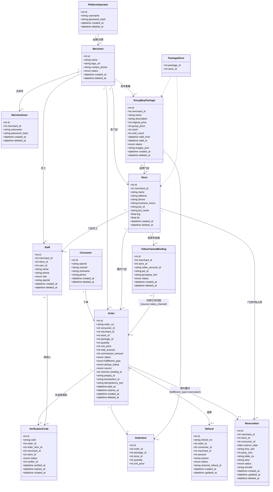
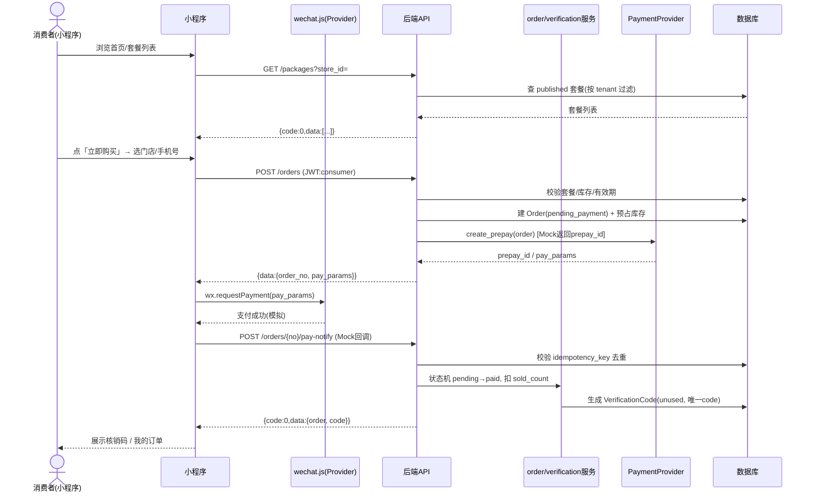
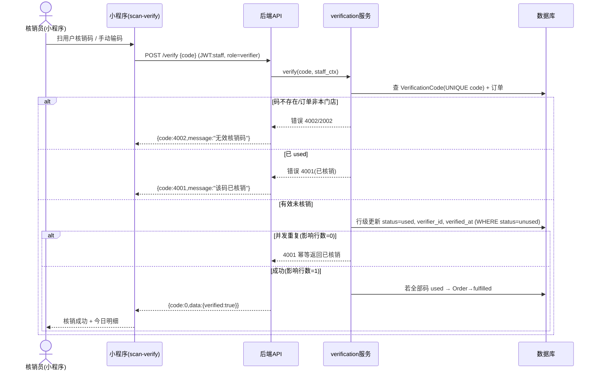
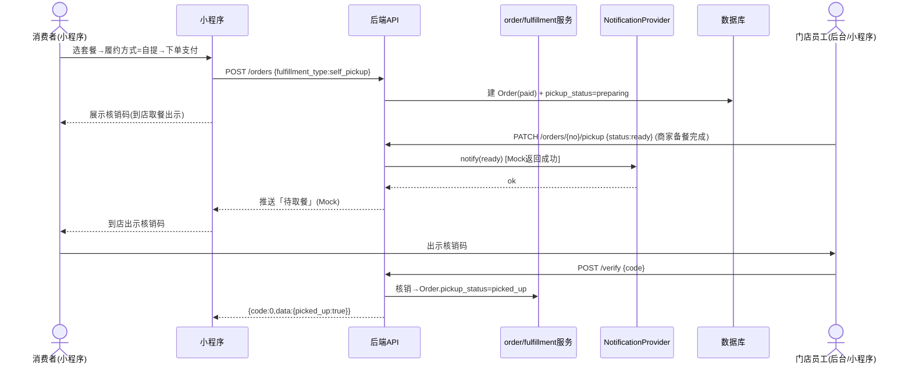
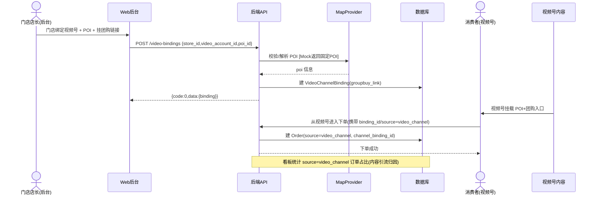
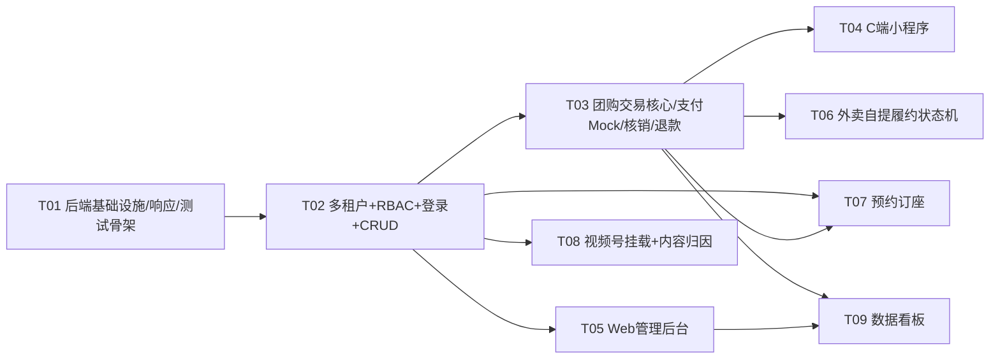

# 微信 POI 团购 SaaS — 系统架构设计 + 任务分解（v1 MVP）

> 文档版本：v0.1（架构设计档）
> 负责人：架构师 高见远（Gao）
> 适用范围：v1 MVP（P0 + P1 全量）
> 配套输入：`docs/PRD/01-产品需求文档.md`、主理人确认的 3 项关键决策

---

## 0. 设计总览（TL;DR）

| 维度 | 决策 |
|------|------|
| 后端 | Python **FastAPI** + **SQLAlchemy 2.0（async）** + **Pydantic v2** + **SQLite(开发)/PostgreSQL(生产)** + **JWT** + **bcrypt** + **Alembic** |
| C 端 | **原生微信小程序**（Native），所有微信能力走 `services/wechat` Provider 抽象（mock/real 切换） |
| Web 后台 | **React 18 + Vite 5 + TypeScript + Tailwind 3 + react-router + axios**（独立工程，共享同一后端 API） |
| 多租户 | `merchant_id` / `store_id` 双层隔离；`TenantContext` 由 JWT 注入，查询层自动加过滤 |
| 微信能力 | **Mock 优先**：`WECHAT_PAY_PROVIDER=mock\|real`、`MAP_POI_PROVIDER=mock\|real`，凭证到位零返工切换 |
| 金额/时间 | 金额一律以**整数「分」**存储与传输；时间一律 **ISO 8601 UTC** |
| 返回结构 | 统一 `{ code, message, data }`，`code=0` 成功 |

> 复用同团队在 `AI-Local-Growth-SaaS` 验证过的 FastAPI 栈与 Mock 优先思路，保持技术一致性。

---

## 1. 实现方案 + 框架选型

### 1.1 后端（Python FastAPI）

沿用已验证栈，理由：

- **FastAPI + Pydantic v2**：类型即文档，自动生成 OpenAPI，便于前端（小程序 + Web）联调。
- **SQLAlchemy 2.0 async**：原生 `async/await`，配合 `asyncpg`（生产）/`aiosqlite`（开发）支撑并发核销。
- **SQLite（开发）→ PostgreSQL（生产）**：Alembic 迁移与 `DATABASE_URL` 切换，零代码改动；开发期零运维。
- **JWT + bcrypt**：无状态鉴权，天然适配多端（小程序 `openid`、Web 账号）；密码用 `bcrypt` 单向散列。
- **Alembic**：基线迁移 + 演进迁移，保证多环境 schema 一致。

### 1.2 C 端小程序：**原生微信小程序（Native）**

选型论证（对比 uni-app / Taro）：

| 方案 | 适配度 | 结论 |
|------|--------|------|
| **原生微信小程序** | JSAPI 支付（`wx.requestPayment`）、`wx.scanCode`、POI 均为官方一等公民，文档最全，真实凭证切换最顺 | ✅ **采用** |
| Taro（React 语法） | 可复用 React 心智，但微信特有 API 仍需条件编译，增加一层编译复杂度 | 备选（若未来要三端复用） |
| uni-app（Vue 语法） | 与本项目 React 技术栈不一致，团队无 Vue 沉淀 | ❌ 不采用 |

工程结构（见第 2 节）。所有微信调用收敛到 `services/wechat.js`：
- mock 模式：`wx.login` 返回假 `code`→后端 mock 换假 `openid`；支付直接成功并回调；`scanCode` 返回测试码。
- real 模式：真实 `wx.login` / `wx.requestPayment` / `wx.scanCode` + POI。

### 1.3 Web 管理后台（React + Vite）

- React 18 + Vite 5 + TS + Tailwind 3：热更新快、类型安全、样式规范统一。
- `react-router`：路由级权限（平台/商户/店长 各自可见菜单）。
- `axios`：统一拦截器处理 `{code,message,data}` 与 401 跳登录。

### 1.4 Mock 策略（核心：可切换 Provider）

后端定义两个 Provider 抽象，工厂按环境变量返回实现：

```
PaymentProvider (ABC)
  ├─ MockPaymentProvider   # 离线：生成假 prepay_id，支付回调自动成功，退款自动成功
  └─ RealWechatPayProvider # 真实 JSAPI：下单→统一下单→回调验签→退款

MapProvider (ABC)
  ├─ MockMapProvider       # 离线：返回固定 POI（名称/地址/经纬度）
  └─ RealTencentMapProvider# 真实：腾讯/微信地图 POI 检索与绑定
```

切换开关（`.env`）：

```
WECHAT_PAY_PROVIDER=mock      # mock | real
MAP_POI_PROVIDER=mock         # mock | real
WECHAT_APPID=                 # 真实小程序 appid（留空即走 mock）
WECHAT_SECRET=
WXPAY_MCH_ID=
WXPAY_API_KEY=
WXPAY_CERT_PATH=
MAP_KEY=
```

> 凭证到位后将 `=mock` 改为 `=real` 并填值即可，业务代码不变。

**P1 能力 Mock 边界（外卖自提 / 预约订座 / 视频号挂载）**：三者同样走「Mock 优先」，不依赖真实微信/地图凭证即可联调：
- **自提通知（备餐完成 notify）**：`NotificationProvider`(ABC) → `MockNotificationProvider` 直接返回成功（不发真实订阅消息），`RealWechatNotifyProvider` 预留微信订阅消息接口；开关 `WECHAT_NOTIFY_PROVIDER=mock|real`。
- **预约订座时段库存**：纯后端逻辑（门店 `reserve_date + time_slot` 占用计数），无外部依赖，Mock/Real 行为一致。
- **视频号挂载 / POI 绑定**：复用 `MapProvider`；`MockMapProvider` 返回固定 POI 与假 `video_account_id`，`groupbuy_link` 由后端按 `package` 生成；`RealTencentMapProvider` 预留视频号小店/挂载 API。
- 以上开关同样进 `.env`，凭证到位切 `real` 即生效，业务代码不变。

---

## 2. 文件列表及相对路径

```
WeChat-POI-Groupbuy-SaaS/
├── docs/
│   ├── PRD/01-产品需求文档.md
│   └── ARCH/
│       ├── 02-系统架构设计.md          # 本文档
│       ├── sequence-diagram.mermaid     # 时序图（提取）
│       └── class-diagram.mermaid        # 类图/ER（提取）
│
├── backend/                            # 后端 API（FastAPI）
│   ├── app/
│   │   ├── main.py                     # 入口：CORS/路由挂载/异常处理器
│   │   ├── core/
│   │   │   ├── config.py               # pydantic-settings，环境变量与 Mock 开关
│   │   │   ├── db.py                   # async engine / SessionLocal / Base / get_db
│   │   │   ├── security.py             # JWT 签发/校验、bcrypt 哈希
│   │   │   ├── tenant.py               # TenantContext、get_tenant_context、require_role
│   │   │   ├── responses.py            # 统一响应模型 + success()/error() 助手
│   │   │   ├── errors.py               # 错误码枚举 ErrorCode
│   │   │   └── exceptions.py           # 业务异常类 + 全局 handler
│   │   ├── models/
│   │   │   ├── __init__.py
│   │   │   ├── tenant.py               # PlatformOperator/Merchant/MerchantUser/Store/Staff/Consumer
│   │   │   ├── catalog.py              # GroupBuyPackage / PackageStore(关联表)
│   │   │   └── order.py                # Order / OrderItem / VerificationCode / Refund
│   │   ├── schemas/
│   │   │   ├── common.py               # Page/PageData、统一响应 Schema
│   │   │   ├── auth.py                 # WxLoginIn / LoginIn / TokenOut
│   │   │   ├── tenant.py               # Merchant/Store/Staff CRUD Schema
│   │   │   ├── catalog.py              # PackageCreate/Update/Out
│   │   │   └── order.py                # OrderCreate/Out、VerifyIn、RefundApplyIn
│   │   ├── services/
│   │   │   ├── payment/
│   │   │   │   ├── base.py             # PaymentProvider(ABC)
│   │   │   │   ├── mock.py             # MockPaymentProvider
│   │   │   │   ├── wechat.py           # RealWechatPayProvider(JSAPI)
│   │   │   │   └── factory.py          # get_payment_provider()
│   │   │   ├── map/
│   │   │   │   ├── base.py             # MapProvider(ABC)
│   │   │   │   ├── mock.py             # MockMapProvider
│   │   │   │   ├── tencent.py          # RealTencentMapProvider
│   │   │   │   └── factory.py          # get_map_provider()
│   │   │   ├── order.py                # 下单 + 支付状态机流转
│   │   │   ├── verification.py         # 核销校验 + 幂等防重
│   │   │   └── refund.py               # 退款校验 + 调用 Provider
│   │   └── api/
│   │       ├── __init__.py
│   │       └── v1/
│   │           ├── auth.py             # wx-login / merchant-login / web-login
│   │           ├── tenants.py          # merchant/store/staff CRUD（带隔离）
│   │           ├── catalog.py          # 套餐 CRUD + 上架/下架
│   │           ├── orders.py           # 下单 / 列表 / 详情 / 支付回调
│   │           ├── verification.py      # 扫码/输码核销
│   │           ├── refunds.py          # 退款申请 / 查询
│   │           └── dashboard.py        # 订单/核销基础看板
│   ├── alembic/
│   │   ├── alembic.ini
│   │   ├── env.py
│   │   └── versions/0001_initial.py    # 基线迁移（全部表 + 索引 + 软删除）
│   ├── scripts/
│   │   └── seed.py                     # 种子：平台运营 + 演示商户/门店/核销员
│   ├── tests/
│   │   ├── conftest.py                 # 测试 client、mock provider 固定、token 助手
│   │   ├── test_auth.py
│   │   ├── test_tenant_isolation.py    # 跨租户拦截断言
│   │   ├── test_order_flow.py          # 下单→支付→核销码
│   │   └── test_verification.py        # 幂等防重断言
│   ├── requirements.txt
│   ├── pyproject.toml
│   └── .env.example
│
├── miniprogram/                       # C 端原生微信小程序
│   ├── app.js / app.json / app.wxss
│   ├── project.config.json
│   ├── sitemap.json
│   ├── config.js                      # API base、mock 开关
│   ├── pages/
│   │   ├── index/                      # 首页：定位+附近门店/团购推荐
│   │   ├── package-detail/             # 团购详情
│   │   ├── checkout/                   # 下单/支付
│   │   ├── order-list/                 # 我的订单
│   │   ├── order-detail/               # 订单详情 + 核销码
│   │   └── scan-verify/                # 核销员扫码核销台
│   ├── services/
│   │   ├── request.js                  # 封装 wx.request + JWT 注入 + 统一响应解析
│   │   ├── wechat.js                   # wx.login/pay/scan Provider（mock/real）
│   │   └── auth.js                     # 登录态缓存
│   ├── utils/format.js                 # 金额(分→元)/时间格式化
│   └── components/package-card/        # 套餐卡片组件
│
└── web-admin/                         # 商户/平台 Web 管理后台（React）
    ├── package.json / vite.config.ts / tsconfig.json
    ├── tailwind.config.js / postcss.config.js
    ├── index.html
    └── src/
        ├── main.tsx / App.tsx / router.tsx
        ├── api/
        │   ├── client.ts               # axios 实例 + 拦截器（统一响应/401）
        │   ├── auth.ts / stores.ts / packages.ts / orders.ts / dashboard.ts
        ├── auth/
        │   ├── AuthContext.tsx         # JWT 存储 + 角色
        │   └── ProtectedRoute.tsx      # 路由级权限
        ├── layout/AdminLayout.tsx       # 侧边栏菜单（按角色显隐）
        ├── pages/
        │   ├── Login.tsx
        │   ├── StoreManage.tsx         # 门店管理 + POI 绑定
        │   ├── PackageManage.tsx       # 套餐管理（上/下架、库存）
        │   └── OrderDashboard.tsx      # 订单/核销看板
        ├── components/                 # 表格/表单等通用组件
        ├── styles/index.css            # Tailwind 指令
        └── types/index.ts              # 前后端共享类型
```

---

## 3. 数据结构和接口（类图 / ER）

见 `docs/ARCH/class-diagram.mermaid`（Mermaid `classDiagram` 同步提取）。

核心约定：
- **软删除**：所有租户/业务实体含 `deleted_at`（NULL=未删），查询默认过滤。
- **金额字段**：`original_price / group_price / unit_price / total_amount / commission_amount / amount` 均为 **INT（分）**。
- **索引/唯一键**：
  - `merchant.name` 普通索引；
  - `store.merchant_id`、`order.merchant_id`、`order.store_id`、`order.consumer_id` 索引；
  - `order.order_no` **UNIQUE**；`verification_code.code` **UNIQUE**（幂等键）；
  - `refund.refund_no` UNIQUE；`consumer.openid` UNIQUE。
- **外键**：`store.merchant_id→merchant.id`、`staff.merchant_id/store_id`、`package.merchant_id`、`order.*`、`verification_code.order_id`、`refund.order_id` 等，均 `ON DELETE RESTRICT`（业务层软删）。



**看板（聚合查询，无新表）**：商户侧指标由 `Order`/`VerificationCode`/`Refund`/`Reservation` 聚合得出——销量=已支付 `OrderItem.quantity` 求和；核销率=已核销 `VerificationCode`/已支付订单；GMV=已支付 `total_amount` 求和（扣退款）；自提/订座转化=对应 `fulfillment_type`/`Reservation` 占比；内容引流占比=`source=video_channel` 订单 / 总订单。平台侧为跨商户同口径汇总（平台运营 `typ` 可跨租户）。指标来源字段均来自既有表，无需新建事实表。

### 3.1 状态机

- **GroupBuyPackage.status**：`draft → published → off_shelf`；`published` 且 `valid_to < now` 自动转 `expired`（定时任务/查询时计算）。
- **Order.status**：`pending_payment → paid → fulfilled`；可 `→ refunded`（全额）/ `→ closed`（支付超时未付）/ `→ cancelled`（用户取消未付）。
  - 支付状态机：`pending_payment` 下单占用库存 → 支付成功 `paid` 正式扣减 `sold_count` → 核销 `fulfilled` → 退款 `refunded`。
- **VerificationCode.status**：`unused → used`（幂等：重复核销直接返回「已核销」）；`unused → expired`（超期）。
- **Refund.status**：`pending → processing → succeeded / failed`。
- **Order.fulfillment_type（履约方式）**：`dine_in`（到店核销，走 `VerificationCode`）/ `self_pickup`（到店自提）/ `reservation`（预约订座，关联 `Reservation`）。
- **自提状态机（Order.pickup_status，仅 `self_pickup`）**：`preparing → ready → picked_up`；商家端更新备餐状态，到 `ready` 触发 Mock 通知用户，用户到店取餐后 `picked_up`（同时核销对应 `VerificationCode`）。
- **Reservation.status（预约订座）**：`pending → confirmed → arrived`（到店）/ `cancelled`（用户取消）/ `released`（超时释放，时段库存回收）。下单占时段库存（`store_id + reserve_date + time_slot` 计数），超时未确认自动 `released`。

---

## 4. 程序调用流程（时序图）

完整 Mermaid 见 `docs/ARCH/sequence-diagram.mermaid`。以下为核心 3 条流程摘要。

### 4.1 C 端：浏览 → 下单 → 微信支付(JSAPI Mock) → 回调 → 生成核销码



### 4.2 门店扫码核销：扫描 → 校验 → 标记已核销（幂等防重）



### 4.3 退款流程：申请 → 校验 → 调用支付退款(Mock) → 更新状态

```mermaid
sequenceDiagram
    actor U as 消费者(小程序)
    participant MP as 小程序
    participant API as 后端API
    participant SVC as refund服务
    participant PAY as PaymentProvider
    participant DB as 数据库

    U->>MP: 我的订单→申请退款(全额)
    MP->>API: POST /refunds {order_no, amount, reason}
    API->>SVC: apply(order, amount)
    SVC->>DB: 校验订单 status=paid/fulfilled 且未退
    SVC->>DB: 建 Refund(pending, refund_no UNIQUE)
    SVC->>PAY: refund(order, amount) [Mock自动成功]
    PAY-->>SVC: channel_refund_id
    SVC->>DB: Refund→succeeded; Order→refunded; 回滚 sold_count
    API-->>MP: {code:0,data:{refund}}
    MP-->>U: 退款成功提示
```

### 4.4 外卖自提履约：下单(自提) → 备餐 → 通知待取 → 到店取



### 4.5 预约订座：选时段/人数 → 占时段库存 → 确认 → 到店/取消/超时释放

```mermaid
sequenceDiagram
    actor U as 消费者(小程序)
    participant MP as 小程序
    participant API as 后端API
    participant SVC as fulfillment服务
    participant DB as 数据库

    U->>MP: 选门店→预约(日期/时段/人数)
    MP->>API: POST /reservations {store_id,reserve_date,time_slot,party_size}
    API->>SVC: 校验时段库存(store_id+date+slot 占用<上限)
    alt 时段已满
        SVC-->>API: 错误 6001(时段已满)
        API-->>MP: {code:6001,message:"该时段已约满"}
    else 有库存
        SVC->>DB: 占时段库存 + 建 Reservation(pending)
        API-->>MP: {code:0,data:{reservation}}
        U->>MP: 确认预约
        MP->>API: PATCH /reservations/{id} {status:confirmed}
        API->>DB: Reservation→confirmed
        API-->>MP: {code:0,data:{confirmed:true}}
        Note over SVC,DB: 超时未确认→released 回收时段库存(定时/查询时)
        U->>MP: 到店/取消
        MP->>API: PATCH /reservations/{id} {status:arrived|cancelled}
        API->>DB: Reservation→arrived/cancelled; cancelled 回收库存
    end
```

### 4.6 视频号挂载 + 内容引流订单归因



---

## 5. 有序任务列表（给工程师寇豆码的直接执行清单）

> T01–T05 为 P0 评审通过、维持原样；T06–T09 为 P1 全量扩展（在 P0 基础上追加），仍按文件级拆解可直接照写。
> 依赖关系：T01 → T02 → T03 → T04；T01 → T02 → T05；T03 → T06；T02/T03 → T07；T02 → T08；T03/T05 → T09。

### T01 — 后端基础设施 + 统一响应/错误处理/测试骨架（P0）

- **所属模块**：backend / 基础设施
- **依赖**：无（首个任务）
- **描述**：
  1. 初始化 FastAPI 工程：`backend/app/main.py` 挂载 CORS、各 `v1` 路由、`ExceptionMiddleware`。
  2. `backend/app/core/config.py`：用 `pydantic-settings` 读取 `.env`，含 `DATABASE_URL`、`JWT_SECRET`、`WECHAT_PAY_PROVIDER`、`MAP_POI_PROVIDER` 等全部 Mock 开关。
  3. `backend/app/core/db.py`：async `engine` + `SessionLocal` + `Base` + `get_db` 依赖；`backend/alembic/env.py` + `alembic.ini` 接入。
  4. `backend/app/core/responses.py` + `errors.py` + `exceptions.py`：实现统一 `{code,message,data}` 结构与全局异常处理器（所有业务异常→统一错误响应）。
  5. `backend/requirements.txt` + `pyproject.toml` + `.env.example`：声明全部依赖。
  6. `backend/alembic/versions/0001_initial.py`：**基线迁移**——创建第 3 节全部表、索引、外键、软删除字段（可先用 `sqlalchemy` metadata `autogenerate` 再校对）。
  7. `backend/tests/conftest.py`：测试 `AsyncClient`、固定 Mock Provider、生成各角色 JWT 的助手。
- **产出文件**：`backend/app/main.py`、`backend/app/core/{config,db,responses,errors,exceptions}.py`、`backend/alembic/{alembic.ini,env.py}`、`backend/alembic/versions/0001_initial.py`、`backend/requirements.txt`、`backend/pyproject.toml`、`backend/.env.example`、`backend/tests/conftest.py`
- **验收标准**：
  - `uvicorn` 启动无错，`GET /docs` 可访问；`alembic upgrade head` 在 SQLite 成功建全表。
  - 任意路由抛 `BizError` 时返回 `{code:非0, message, data:null}`，HTTP 状态码对应。
  - `pytest` 能启动（至少一个空测试通过）。

### T02 — 多租户模型 + RBAC 鉴权 + 登录 + 商户/门店/员工 CRUD（P0）

- **所属模块**：backend / 租户与鉴权
- **依赖**：T01
- **描述**：
  1. `backend/app/models/tenant.py`：`PlatformOperator`、`Merchant`、`MerchantUser`、`Store`、`Staff`（含 `role` 枚举 `store_manager|verifier`）、`Consumer`（含 `openid`）。
  2. `backend/app/core/security.py`：JWT 签发/校验（载荷见第 7 节）、`bcrypt` 密码哈希。
  3. `backend/app/core/tenant.py`：`get_tenant_context` 依赖（解析 JWT→`TenantContext(role, merchant_id, store_id, user_id)`）、`require_role(...)` 守卫。
  4. `backend/app/api/v1/auth.py`：`POST /auth/wx-login`（小程序 `code`→provider 换 `openid`→发 consumer JWT）、`POST /auth/merchant-login`、`POST /auth/web-login`（平台/商户/店长账号，bcrypt 校验）。
  5. `backend/app/api/v1/tenants.py`：`/merchants`、`/stores`、`/staff` 的 CRUD，所有写读注入 `TenantContext` 过滤（平台可跨商户，商户主限本 merchant，店长限本 store）。
  6. `backend/app/schemas/{auth,tenant}.py`：对应请求/响应 Schema。
  7. `backend/scripts/seed.py`：种子一个平台运营 + 一个演示商户 + 门店 + 核销员（bcrypt 密码）。
  8. `backend/tests/test_auth.py`、`test_tenant_isolation.py`：登录拿 token；以商户 A token 访问商户 B 门店须返回跨租户错误（错误码 2002）。
- **产出文件**：`backend/app/models/tenant.py`、`backend/app/core/{security,tenant}.py`、`backend/app/api/v1/{auth,tenants}.py`、`backend/app/schemas/{auth,tenant}.py`、`backend/scripts/seed.py`、`backend/tests/{test_auth,test_tenant_isolation}.py`
- **验收标准**：
  - 小程序 `wx-login` 返回 consumer JWT；Web 各角色登录返回对应 JWT（载荷含 `role/merchant_id/store_id`）。
  - 商户 A 的 token 请求商户 B 资源 → `code=2002`；店长 token 改其他门店 → 被拒。
  - `seed.py` 跑通后可用演示账号登录；`pytest` 两项测试通过。

### T03 — 团购交易核心：套餐 + 下单 + 支付 Mock + 核销码 + 扫码核销幂等 + 退款（P0）

- **所属模块**：backend / 交易
- **依赖**：T02
- **描述**：
  1. `backend/app/models/catalog.py`：`GroupBuyPackage` + `PackageStore` 关联表；`backend/app/models/order.py`：`Order`/`OrderItem`/`VerificationCode`/`Refund`（字段见第 3 节）。
  2. `backend/app/services/payment/{base,mock,wechat,factory}.py`：`PaymentProvider` ABC；`MockPaymentProvider`（离线生成 `prepay_id`、支付/退款恒成功）；`RealWechatPayProvider`（JSAPI 统一下单/回调验签/退款，凭证位预留）；`get_payment_provider()` 按 `WECHAT_PAY_PROVIDER` 返回。
  3. `backend/app/services/map/{base,mock,tencent,factory}.py`：同上模式，门店 POI 绑定用。
  4. `backend/app/services/order.py`：下单（校验套餐/库存/有效期、预占库存、建 `Order`+`OrderItem`、调 `PaymentProvider.create_prepay` 返回 `pay_params`）、支付回调（按 `idempotency_key` 去重、状态机 `pending→paid`、扣 `sold_count`、**生成 `VerificationCode`**）、支付超时关闭。
  5. `backend/app/services/verification.py`：核销校验 + **幂等防重**（UPDATE … WHERE status=unused，影响行数 0 即「已核销」；全部码 used→`Order→fulfilled`）。
  6. `backend/app/services/refund.py`：退款校验（订单须 `paid/fulfilled` 且未退）、建 `Refund`、调 `PaymentProvider.refund`、状态更新 + 回滚 `sold_count`。
  7. `backend/app/api/v1/catalog.py`：套餐 CRUD + `publish/off_shelf`（仅商户主/店长）。
  8. `backend/app/api/v1/orders.py`：`POST /orders`、`GET /orders`、`GET /orders/{no}`、`POST /orders/{no}/pay-notify`（Mock 回调）。
  9. `backend/app/api/v1/verification.py`：`POST /verify {code}`（需 `verifier` 角色）。
  10. `backend/app/api/v1/refunds.py`：`POST /refunds`、`GET /refunds/{no}`。
  11. `backend/app/schemas/{catalog,order}.py`：对应 Schema。
  12. `backend/tests/test_order_flow.py`、`test_verification.py`：下单→支付→核销码生成；同一码二次核销返回「已核销」（4001）。
- **产出文件**：`backend/app/models/{catalog,order}.py`、`backend/app/services/payment/{base,mock,wechat,factory}.py`、`backend/app/services/map/{base,mock,tencent,factory}.py`、`backend/app/services/{order,verification,refund}.py`、`backend/app/api/v1/{catalog,orders,verification,refunds}.py`、`backend/app/schemas/{catalog,order}.py`、`backend/tests/{test_order_flow,test_verification}.py`
- **验收标准**：
  - 调 `POST /orders` 后拿到 `pay_params`；Mock 回调后 `Order.status=paid` 且生成 `VerificationCode`。
  - 同一 `code` 第二次 `POST /verify` 返回 `code=4001`；并发两次仅一次成功。
  - 申请退款后 `Order.status=refunded`、`Refund.status=succeeded`、`sold_count` 回滚。
  - `pytest` 两项通过；`WECHAT_PAY_PROVIDER` 切换不影响业务流程。

### T04 — C 端微信小程序：首页/套餐/下单支付/我的订单/核销台（P0）

- **所属模块**：miniprogram
- **依赖**：T03（需后端 API 就绪）
- **描述**：
  1. `miniprogram/config.js`：API base、mock 开关；`app.js/json/wxss`、`project.config.json`、`sitemap.json` 工程配置。
  2. `miniprogram/services/request.js`：封装 `wx.request` + 注入 JWT + 解析统一响应；`services/wechat.js`：`wx.login/pay/scan` Provider（mock 模式模拟成功与返回测试码）；`services/auth.js`：登录态缓存。
  3. `miniprogram/utils/format.js`：金额（分→元）、时间格式化。
  4. `miniprogram/pages/index/`：首页（定位 + 附近门店/团购推荐，调 `GET /packages`）。
  5. `miniprogram/pages/package-detail/`：套餐详情（原价划线/团购价/库存/有效期/适用门店 + POI）。
  6. `miniprogram/pages/checkout/`：下单（选门店/手机号）→ `POST /orders` → `wx.requestPayment(pay_params)` → 模拟支付成功 → 调 `/pay-notify`。
  7. `miniprogram/pages/order-list/` + `order-detail/`：我的订单（待支付/待核销/已完成/退款）、订单详情展示**核销二维码/码**。
  8. `miniprogram/pages/scan-verify/`：核销员扫码台（`wx.scanCode`→`POST /verify`；手动输码；展示今日明细）。
  9. `miniprogram/components/package-card/`：复用卡片组件。
- **产出文件**：`miniprogram/{config.js,app.js,app.json,app.wxss,project.config.json,sitemap.json}`、`miniprogram/services/{request,wechat,auth}.js`、`miniprogram/utils/format.js`、`miniprogram/pages/{index,package-detail,checkout,order-list,order-detail,scan-verify}/*`、`miniprogram/components/package-card/*`
- **验收标准**：
  - 小程序可走通：浏览→详情→下单→（Mock）支付→我的订单见核销码。
  - 核销员扫码 → 成功提示；扫同一码第二次 → 「已核销」。
  - 微信开发者工具编译无报错；mock 模式无需真实凭证可联调。

### T05 — Web 管理后台：登录/门店管理/套餐管理/订单与核销看板（P0）

- **所属模块**：web-admin
- **依赖**：T02、T03
- **描述**：
  1. `web-admin/package.json` + `vite.config.ts` + `tsconfig.json` + `tailwind.config.js` + `postcss.config.js` + `index.html`：脚手架与依赖（react、react-router-dom、axios、tailwindcss 等）。
  2. `web-admin/src/main.tsx` + `App.tsx` + `router.tsx`：入口与路由。
  3. `web-admin/src/api/client.ts`：axios 实例 + 拦截器（统一 `{code,message,data}` 解析、401 跳登录）；`auth.ts/stores.ts/packages.ts/orders.ts/dashboard.ts` 封装各接口。
  4. `web-admin/src/auth/AuthContext.tsx` + `ProtectedRoute.tsx`：JWT 存储、角色解析、路由级权限（平台/商户/店长菜单显隐）。
  5. `web-admin/src/layout/AdminLayout.tsx`：侧边栏（按角色显隐：门店管理/套餐管理/订单看板）。
  6. `web-admin/src/pages/Login.tsx`：Web 登录（调 `/auth/web-login`）。
  7. `web-admin/src/pages/StoreManage.tsx`：门店列表/增改、**绑定/解绑地图 POI**（调 `MapProvider` 相关接口）。
  8. `web-admin/src/pages/PackageManage.tsx`：套餐列表（上/下架、库存）、新建表单（原价/团购价/有效期/适用门店/图文）、发布。
  9. `web-admin/src/pages/OrderDashboard.tsx`：实时订单流、核销成功率、今日 GMV、按门店/套餐筛选。
  10. `web-admin/src/components/*` + `styles/index.css` + `types/index.ts`：通用组件、Tailwind 样式、共享类型。
- **产出文件**：`web-admin/{package.json,vite.config.ts,tsconfig.json,tailwind.config.js,postcss.config.js,index.html}`、`web-admin/src/{main.tsx,App.tsx,router.tsx}`、`web-admin/src/api/{client,auth,stores,packages,orders,dashboard}.ts`、`web-admin/src/auth/{AuthContext,ProtectedRoute}.tsx`、`web-admin/src/layout/AdminLayout.tsx`、`web-admin/src/pages/{Login,StoreManage,PackageManage,OrderDashboard}.tsx`、`web-admin/src/components/*`、`web-admin/src/styles/index.css`、`web-admin/src/types/index.ts`
- **验收标准**：
  - `npm run dev` 启动；平台/商户/店长登录后看到各自应见菜单。
  - 店长可管理本门店（含 POI 绑定）、发布/下架套餐、查看订单与核销看板。
  - 跨角色访问受限页面被 `ProtectedRoute` 拦截。

### T06 — 外卖自提履约状态机（P1）

- **所属模块**：backend + miniprogram + web-admin / 履约
- **依赖**：T03
- **描述**：
  1. `backend/app/models/order.py`：`Order` 扩展 `fulfillment_type`（enum: `dine_in`/`self_pickup`/`reservation`）、`pickup_status`（enum: `preparing`/`ready`/`picked_up`，nullable）。
  2. `backend/app/schemas/order.py`：下单入参增加 `fulfillment_type`；新增 `PickupUpdateIn`。
  3. `backend/app/services/fulfillment.py`：自提状态机流转（`preparing→ready→picked_up`），`ready` 时调 `NotificationProvider.notify`（Mock 返回成功）。
  4. `backend/app/api/v1/orders.py`：扩展 `POST /orders` 支持 `self_pickup`；新增 `PATCH /orders/{no}/pickup` 商家更新备餐状态。
  5. `backend/app/api/v1/verification.py`：核销 `self_pickup` 订单时同步置 `pickup_status=picked_up`。
  6. `miniprogram/pages/checkout/`：下单页支持「到店自提」履约方式；`miniprogram/pages/order-detail/` 展示自提状态（备餐中/待取/已取）。
  7. `web-admin/src/pages/OrderDashboard.tsx`：店长/核销员可更新备餐状态的操作入口。
  8. `backend/tests/test_fulfillment.py`：自提下单→备餐完成→到店取 状态流转断言。
- **产出文件**：`backend/app/models/order.py`（扩展）、`backend/app/schemas/order.py`（扩展）、`backend/app/services/fulfillment.py`、`backend/app/api/v1/{orders,verification}.py`（扩展）、`miniprogram/pages/{checkout,order-detail}/*`、`web-admin/src/pages/OrderDashboard.tsx`（扩展）、`backend/tests/test_fulfillment.py`
- **验收标准**：
  - 下单 `fulfillment_type=self_pickup` 后 `Order.pickup_status=preparing`；`PATCH /pickup {ready}` 后=`ready` 且 Mock 通知成功；核销后=`picked_up`。
  - 小程序 order-detail 正确展示自提三态；`pytest` 断言流转正确。

### T07 — 预约订座（P1）

- **所属模块**：backend + miniprogram + web-admin / 履约
- **依赖**：T02、T03
- **描述**：
  1. `backend/app/models/fulfillment.py`：新建 `Reservation`（见第 3 节字段；含 `store_id + reserve_date + time_slot` 时段库存占用逻辑）。
  2. `backend/app/schemas/fulfillment.py`：`ReservationCreate/Update/Out`。
  3. `backend/app/services/fulfillment.py`：预约占时段库存（冲突校验 + 计数）、确认/取消/超时释放回收库存。
  4. `backend/app/api/v1/fulfillment.py`：`POST /reservations`、`GET /reservations`、`PATCH /reservations/{id}`（`confirmed`/`arrived`/`cancelled`）、超时释放（定时/查询时处理）。
  5. `miniprogram/pages/reservation/`：C 端预约页（选门店/日期/时段/人数 → 下单 → 确认）。
  6. `web-admin/src/pages/ReservationManage.tsx`：后台预约看板（列表/确认/取消/超时）。
  7. `backend/tests/test_fulfillment.py`：时段冲突返回 6001、取消回收库存断言。
- **产出文件**：`backend/app/models/fulfillment.py`、`backend/app/schemas/fulfillment.py`、`backend/app/services/fulfillment.py`、`backend/app/api/v1/fulfillment.py`、`miniprogram/pages/reservation/*`、`web-admin/src/pages/ReservationManage.tsx`、`backend/tests/test_fulfillment.py`
- **验收标准**：
  - 同 `store_id + reserve_date + time_slot` 超出上限 → `code=6001`；预约 `confirmed` 后占用计数+1；`cancelled`/`released` 后回收。
  - 小程序预约页可完成预约；后台看板可见并操作；`pytest` 断言正确。

### T08 — 视频号挂载 + 内容引流归因（P1）

- **所属模块**：backend + web-admin / 生态打通
- **依赖**：T02（门店/POI）
- **描述**：
  1. `backend/app/models/fulfillment.py`：新建 `VideoChannelBinding`（见第 3 节字段）。
  2. `backend/app/schemas/fulfillment.py`：`VideoBindingCreate/Out`。
  3. `backend/app/services/fulfillment.py`：绑定/解绑视频号 POI（调 `MapProvider` 解析 POI，Mock 返回固定 POI + 假 `video_account_id`），生成 `groupbuy_link`。
  4. `backend/app/api/v1/fulfillment.py`：`POST /video-bindings`、`GET /video-bindings`、`DELETE /video-bindings/{id}`。
  5. `backend/app/api/v1/orders.py`：下单入参支持 `channel_binding_id`，落 `Order.source=video_channel` + `channel_binding_id` 归因。
  6. `web-admin/src/pages/ChannelBinding.tsx`：视频号 POI/团购挂载管理页。
- **产出文件**：`backend/app/models/fulfillment.py`（扩展）、`backend/app/schemas/fulfillment.py`（扩展）、`backend/app/services/fulfillment.py`（扩展）、`backend/app/api/v1/fulfillment.py`、`backend/app/api/v1/orders.py`（扩展）、`web-admin/src/pages/ChannelBinding.tsx`
- **验收标准**：
  - 绑定视频号后生成 `groupbuy_link`；下单携带 `channel_binding_id` 后 `Order.source=video_channel` 可被看板归因。
  - Mock 模式无需真实凭证即可绑定与归因；`pytest` 断言归因字段写入。

### T09 — 数据看板（P1）

- **所属模块**：backend + web-admin / 数据
- **依赖**：T03、T05
- **描述**：
  1. `backend/app/api/v1/dashboard.py`：扩展为聚合接口——商户侧（销量、核销率、GMV、自提/订座转化、内容引流占比）+ 平台运营汇总（跨商户同口径）。
  2. `backend/app/services/metrics.py`：指标聚合查询（基于 `Order`/`VerificationCode`/`Refund`/`Reservation` 既有字段，无新表）。
  3. `web-admin/src/api/dashboard.ts`：封装看板接口。
  4. `web-admin/src/pages/DataDashboard.tsx`：数据看板页（销量/核销率/GMV/渠道占比图表，支持时间范围筛选）。
  5. `backend/tests/test_dashboard.py`：指标计算断言（核销率 = 已核销/已支付 等）。
- **产出文件**：`backend/app/api/v1/dashboard.py`（扩展）、`backend/app/services/metrics.py`、`web-admin/src/api/dashboard.ts`（扩展）、`web-admin/src/pages/DataDashboard.tsx`、`backend/tests/test_dashboard.py`
- **验收标准**：
  - 商户侧看板返回销量/核销率/GMV；平台侧汇总跨商户（需平台 `typ`）；内容引流占比 = `source=video_channel` 订单 / 总订单。
  - `pytest` 断言指标公式正确。

---

## 6. 依赖包列表

### 6.1 后端 `backend/requirements.txt`

```
fastapi==0.110.*
uvicorn[standard]==0.29.*
pydantic==2.6.*
pydantic-settings==2.2.*
sqlalchemy==2.0.*
aiosqlite==0.20.*            # 开发期 SQLite 异步驱动
asyncpg==0.29.*              # 生产期 PostgreSQL 异步驱动（按需）
alembic==1.13.*
python-jose[cryptography]==3.3.*
passlib[bcrypt]==1.7.*
python-multipart==0.0.9      # 表单/文件上传
httpx==0.27.*                # 真实微信/地图 API 调用 + 测试 AsyncClient
pycryptodome==3.20.*         # 微信支付回调解密（real 用）
pytest==8.1.*
pytest-asyncio==0.23.*
```

### 6.2 小程序 `miniprogram/package.json`（关键依赖）

> 原生小程序无 npm 运行时依赖即可运行；以下为开发态可选工具链。
```
{
  "devDependencies": {
    "typescript": "^5.4.0",
    "miniprogram-api-typings": "^3.12.0"
  }
}
```
> 运行时仅用微信原生 API（`wx.*`），不引入第三方网络库，避免小程序包体积与审核风险。

### 6.3 Web 后台 `web-admin/package.json`（关键依赖）

```
{
  "dependencies": {
    "react": "^18.3.1",
    "react-dom": "^18.3.1",
    "react-router-dom": "^6.23.0",
    "axios": "^1.7.0"
  },
  "devDependencies": {
    "vite": "^5.2.0",
    "@vitejs/plugin-react": "^4.3.0",
    "typescript": "^5.4.0",
    "tailwindcss": "^3.4.0",
    "postcss": "^8.4.0",
    "autoprefixer": "^10.4.0"
  }
}
```

---

## 7. 共享知识（跨文件约定）

1. **统一返回结构**：所有接口返回
   ```json
   { "code": 0, "message": "ok", "data": { } }
   ```
   `code=0` 成功；非 0 为业务错误（见错误码）。列表接口 `data` 形如 `{ list: [...], total, page, page_size }`。

2. **JWT 载荷结构**（`pydantic-settings` + `python-jose`）：
   ```json
   {
     "sub": "<user_id>",
     "typ": "platform | merchant | staff | consumer",
     "role": "platform_operator | merchant_owner | store_manager | verifier | consumer",
     "merchant_id": 123,
     "store_id": 456,
     "exp": 1718000000
   }
   ```
   - `platform`：可跨商户；`merchant`：限 `merchant_id`；`staff`：限 `merchant_id` + `store_id`；`consumer`：限自身 `sub`。

3. **租户/商户/门店上下文注入**：`get_tenant_context`（依赖）解析 JWT → `TenantContext`；`models` 查询基类提供 `by_tenant(ctx)` 自动加 `merchant_id`（及 `store_id`）过滤；写操作强制带 `merchant_id`。**禁止**在业务代码里用手写 `if` 判断租户，一律走 `TenantContext`。

4. **金额单位**：所有金额字段为 **INT（分）**，前端 `format.js`/`utils` 除以 100 显示「元」；接口入参 `total_amount` 等也以分为单位。避免浮点误差。

5. **时间单位**：存储与接口一律 **ISO 8601 UTC**（如 `2025-08-13T12:00:00Z`）；前端按本地时区展示。

6. **Mock 开关环境变量**（`.env`）：
   ```
   WECHAT_PAY_PROVIDER=mock|real     # 微信支付
   MAP_POI_PROVIDER=mock|real        # 地图 POI
   WECHAT_NOTIFY_PROVIDER=mock|real  # 自提/预约通知（Mock返回成功）
   WECHAT_APPID= / WECHAT_SECRET=    # 小程序凭证（留空走 mock）
   WXPAY_MCH_ID= / WXPAY_API_KEY= / WXPAY_CERT_PATH=
   MAP_KEY=
   DATABASE_URL=sqlite+aiosqlite:///./dev.db
   JWT_SECRET=change-me
   ```

7. **错误码规范**（枚举 `ErrorCode`，`code` 非 0）：
   | 段 | 含义 | 示例 |
   |----|------|------|
   | 0 | 成功 | 0 |
   | 1000–1099 | 认证/授权 | 1001 无效 token；1002 过期；1003 无权限 |
   | 2000–2099 | 租户/资源 | 2001 不存在；2002 跨租户拒绝；2003 已存在 |
   | 3000–3099 | 订单 | 3001 不存在；3002 状态非法；3003 库存不足；3004 支付超时 |
   | 4000–4099 | 核销 | 4001 已核销（幂等）；4002 无效码；4003 已过期 |
| 5000–5099 | 支付/退款 | 5001 支付失败；5002 退款失败；5003 渠道异常 |
| 6000–6099 | 履约（自提/预约） | 6001 时段已满；6002 预约不存在；6003 预约状态非法 |
| 9000 | 未知 | 9000 系统错误 |

8. **幂等键**：
   - 核销：`verification_code.code` 全局 UNIQUE，重复核销直接返回 4001。
   - 支付：`Order.idempotency_key`（= `order_no`）在回调中查重，重复回调安全幂等。
   - 退款：`Refund.refund_no` UNIQUE。

9. **软删除约定**：查询默认 `deleted_at IS NULL`；提供批量/单条软删接口，禁止物理删核心业务数据。

---

## 8. 待明确事项（默认建议）

| # | 待明确点 | 默认建议 |
|---|----------|----------|
| 1 | 小程序具体框架最终选型 | **原生微信小程序**（已定，见 1.2）；如未来要三端复用再评估 Taro |
| 2 | 退款金额计算规则 | MVP 仅做**全额退款**；`amount` 字段预留支持部分退款（≤ `total_amount`），退款原路返回 |
| 3 | 核销码有效期 | 默认 = `min(套餐 valid_to, 支付后 +30天)`，二者取较早；超期 `unused→expired` |
| 4 | 库存扣减时机 | 下单即**预占**，支付成功正式扣 `sold_count`，支付超时/取消**回滚**；退款回滚 |
| 5 | 平台抽佣/分账 | P2 不做自动分账；`Order.commission_amount` 数据位预留（= `total_amount * 佣金率`，默认 0），供线下对账 |
| 6 | POI 绑定数据源 | MVP 用 `MockMapProvider` 返回固定 POI；预留 `RealTencentMapProvider`（腾讯地图 Key） |
| 7 | 支付超时时长 | 默认下单后 **15 分钟**未支付自动 `closed` 并回滚库存 |
| 8 | 消费者登录态 | `wx.login` 拿 `code`→后端换 `openid` 建/取 `Consumer`→发 JWT；首次自动注册 |

> 以上默认建议在凭证与细节到位后由工程师确认；均不影响 MVP 接口与数据模型结构。

---

## 9. 任务依赖图



> 注：T04、T05 可并行；T03 为交易闭环关键路径，须先于两端联调完成。P1 的 T06–T09 在 P0 之上追加：T06 依赖 T03；T07 依赖 T02/T03；T08 依赖 T02（门店/POI）；T09 依赖 T03/T05；T06–T09 彼此独立，可与 T04/T05 并行推进。
