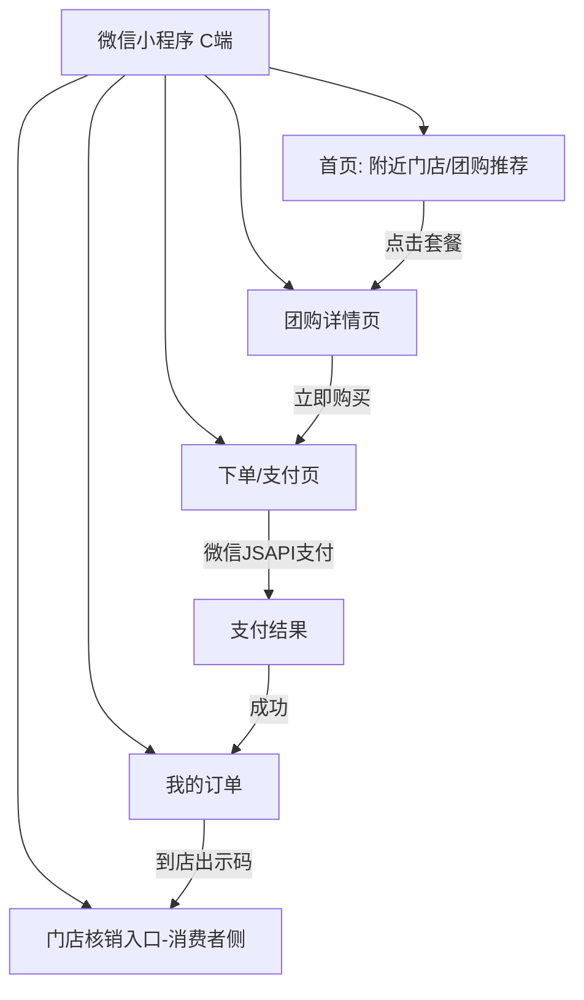
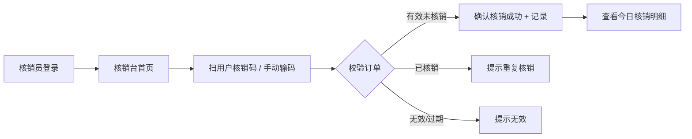
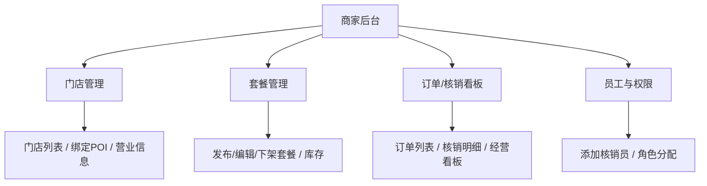

# 微信视频号 POI 团购 SaaS 系统 — 产品需求文档（简单 PRD）

> 文档版本：v0.1（简单 PRD 档）
> 负责人：产品经理 许清楚（Xu）
> 适用范围：v1 MVP 规划与评审
> 文档性质：产品层需求定义，不含架构/代码设计

---

## 1. 产品目标

**一句话目标**
帮助本地生活商家在微信生态内一站式完成「内容引流 → 团购交易 → 到店核销」的经营闭环，用最低门槛把视频号/小红书流量变成门店真实到店生意。

**北极星指标**
> **月核销订单数（Monthly Fulfilled Orders）**
> 辅以：月 GMV、核销率（核销订单 / 已支付订单）、内容引流订单占比。

**3 条核心成功标准**
1. 入驻商户可在 30 分钟内完成「开店 → 绑定 POI → 发布团购套餐 → 被 C 端下单」全流程，且首单可顺利核销。
2. 核销环节零重复核销、零漏核销，核销数据准确率 ≥ 99.9%（防并发/防截图复用）。
3. 通过视频号挂载 POI + 团购、小红书种草挂链带来的订单占商户总订单比例逐月提升（验证"内容 → 交易"通路有效）。

---

## 2. 目标用户与角色

| 角色 | 身份说明 | 核心诉求 |
|------|----------|----------|
| **平台运营方** | SaaS 平台拥有者/运营团队 | 多租户隔离、商户入驻审核、佣金/对账、平台级数据与风控 |
| **商户主** | 连锁或多门店品牌的经营者 | 统一管理旗下门店、发布/下架团购套餐、查看经营数据与分账 |
| **门店店长** | 单个门店负责人 | 维护门店信息、绑定地图 POI、管理员工与核销权限、看门店订单/核销看板 |
| **门店核销员** | 门店前台/服务员 | 快速扫码或输码核销、查看备餐/订座状态、无培训即可上手 |
| **C 端消费者** | 微信/视频号/小红书用户 | 浏览团购、到店自提/预约订座、下单支付、到店核销、查看我的订单 |

---

## 3. 用户故事（按角色，覆盖 6 大模块）

**平台运营方**
- 作为平台运营，我希望对商户和门店做多租户隔离与权限管控，以便不同商户数据互不泄露、平台可统一治理。
- 作为平台运营，我希望查看全平台 GMV 与核销率看板，以便评估经营健康度与抽佣结算。

**商户主**（模块：多商户多门店 / 团购套餐）
- 作为商户主，我希望创建多个门店并分配给不同店长，以便连锁品牌统一经营。
- 作为商户主，我希望发布团购套餐（原价/团购价/库存/有效期/适用门店），以便用户在小程序与视频号下单。

**门店店长**（模块：多商户多门店 / 生态打通-地图 POI）
- 作为门店店长，我希望把门店绑定到微信/腾讯地图 POI，以便在视频号、朋友圈挂载门店位置与团购链接。
- 作为门店店长，我希望查看本门店订单与核销看板，以便实时掌握经营与履约情况。

**门店核销员**（模块：扫码核销 / 外卖自提 / 预约订座）
- 作为核销员，我希望扫码或输入核销码完成履约核销，以便防止重复核销并快速服务顾客。
- 作为核销员，我希望看到外卖自提订单的备餐状态，以便准确叫号出餐。
- 作为核销员，我希望查看预约订座信息（日期/时段/人数/桌位），以便提前排桌。

**C 端消费者**（模块：外卖自提 / 预约订座 / 支付 / 生态打通）
- 作为消费者，我希望在微信小程序或视频号里浏览并下单团购套餐，以便获得更优惠的到店消费。
- 作为消费者，我希望选择「到店自提」履约方式并查看备餐进度，以便到店即取不排队。
- 作为消费者，我希望预约到店订座（选日期时段人数），以便避免排队等位。
- 作为消费者，我希望用微信支付完成付款并可在小程序内申请退款，以便交易有保障。
- 作为消费者，我希望在小红书看到商家种草内容并点击直达团购，以便被内容种草后便捷下单。

---

## 4. 需求池（按 P0 / P1 / P2 分级）

> 优先级定义：P0 = 首版必须；P1 = 重要但可后续；P2 = 锦上添花。
> 注：MVP 首版强制纳入 **多商户多门店、扫码核销、微信支付** 三项 P0。

### P0（首版必须）

| 编号 | 模块 | 需求描述 | 验收要点 | 优先级 |
|------|------|----------|----------|--------|
| P0-01 | 多商户多门店 | 平台运营方创建商户，商户下创建多门店；商家/门店/员工/权限四层隔离 | 商户 A 无法访问商户 B 数据；同商户下店长仅能管自己门店；员工仅具被授权功能 | P0 |
| P0-02 | 多商户多门店 | 员工账号与角色权限（商户主/店长/核销员）管理与分配 | 可为门店分配核销员并限定功能范围；权限变更即时生效 | P0 |
| P0-03 | 团购套餐 | 商户发布团购套餐（名称、原价、团购价、库存、有效期、适用门店、图文） | 套餐可上架到小程序；库存扣减准确；到期自动下架 | P0 |
| P0-04 | 扫码核销 | 门店核销员扫码 / 输入核销码完成履约核销，防重复核销 | 同一订单核销一次即锁定；重复扫码提示已核销；核销记录可追溯 | P0 |
| P0-05 | 微信支付 | 微信 JSAPI 支付（小程序内），含支付成功回调与订单状态流转 | 用户可完成支付；支付后订单状态正确；网络异常可重试不重复扣款 | P0 |
| P0-06 | 微信支付 | 退款能力（全额/部分），含退款状态回流 | 用户可申请退款；退款原路返回；订单与对账状态更新 | P0 |
| P0-07 | C 端小程序 | 小程序首页、团购详情、下单/支付、我的订单基础流程可用 | 消费者可浏览→下单→支付→查看订单；全流程跑通 | P0 |
| P0-08 | 生态打通-地图 POI | 门店绑定微信/腾讯地图 POI（POI ID 关联） | 门店可绑定/解绑 POI；POI 信息与门店一一对应 | P0 |

### P1（重要，可后续）

| 编号 | 模块 | 需求描述 | 验收要点 | 优先级 |
|------|------|----------|----------|--------|
| P1-01 | 外卖自提 | 团购/单品支持「到店自提」履约，含备餐状态机（待接单/备餐中/待取/已取） | 自提订单状态可流转；核销员可见备餐进度 | P1 |
| P1-02 | 预约订座 | 到店预约/订座（日期+时段+人数+桌位），与门店库存（桌位）冲突校验 | 同时段同桌位不重复占用；可取消/改期 | P1 |
| P1-03 | 生态打通-视频号 | 视频号挂载 POI + 团购链接（小店/挂载能力对接） | 视频号内容可挂门店 POI 与团购入口；跳转小程序下单 | P1 |
| P1-04 | 商户后台 | 商户/门店管理后台（订单、套餐、核销看板） | 店长可看门店订单与核销看板；商户主可看汇总数据 | P1 |
| P1-05 | 数据看板 | 平台与商户经营数据看板（GMV、核销率、订单趋势） | 关键指标可筛选时间范围并导出 | P1 |

### P2（锦上添花）

| 编号 | 模块 | 需求描述 | 验收要点 | 优先级 |
|------|------|----------|----------|--------|
| P2-01 | 生态打通-小红书 | 小红书内容种草出口（笔记/团购卡片分发，非交易闭环） | 可生成带团购链接的分享卡片；仅分发不闭环 | P2 |
| P2-02 | 营销工具 | 限时秒杀、新人券、满减等基础营销 | 可配置活动并影响团购价展示 | P2 |
| P2-03 | 消息通知 | 微信订阅消息/模板消息（核销成功、备餐完成、预约提醒） | 关键节点触达用户且不过度骚扰 | P2 |
| P2-04 | 分账 | 平台与商户自动分账（微信支付分账） | 交易后按规则自动分账并出对账单 | P2 |

---

## 5. UI 设计稿（结构描述 + Mermaid）

> 以下为关键页面结构描述与流程示意，非视觉稿。

### 5.1 小程序（C 端）关键页面

**小程序信息架构**

**首页 / 团购详情 / 下单支付 线框结构**
- **首页**：顶部定位+门店切换；Banner 视频号/团购推荐；「附近团购」卡片列表（图+团购价+原价+销量）；入口：预约订座、自提专区。
- **团购详情**：头图/视频、套餐名、原价划线+团购价、库存/有效期、适用门店列表（带 POI）、「立即购买」「到店自提」按钮。
- **下单/支付**：选适用门店、填手机号、选履约方式（到店核销 / 到店自提 / 预约订座）、订单金额、微信支付按钮 → 拉起 JSAPI。

**我的订单 / 门店核销台**
- **我的订单**：订单列表（待支付/待核销/已完成/退款）；订单详情含核销二维码/核销码、备餐状态、预约信息。
- **核销台（消费者侧）**：展示当前订单核销码，到店出示由店员扫码。

### 5.2 门店核销台（核销员）

### 5.3 商户/门店后台

**后台信息架构**

**关键页面结构**
- **门店管理**：门店列表（含 POI 绑定状态）、新增/编辑门店、绑定/解绑地图 POI、营业时间。
- **套餐管理**：套餐列表（上架状态/库存）、新建套餐表单（原价/团购价/有效期/适用门店/图文）、上下架操作。
- **订单/核销看板**：实时订单流、核销成功率、今日 GMV、按门店/套餐维度筛选，支持导出。

---

## 6. 待确认问题（Open Questions）

以下问题需用户/老板拍板，将直接影响 MVP 范围与技术方案选型：

1. **微信生态凭证现状**
   - 是否已有：微信小程序 `appid` / `secret`、微信支付商户号（`mchid`）与 API 证书、腾讯地图/微信地图 POI Key？
   - 若尚未齐备，是否先以**沙箱 / Mock 环境**做产品与联调设计，待凭证就绪再切真实环境？

2. **MVP 首版范围**
   - 4 类交易能力（团购 / 外卖自提 / 预约订座 / 扫码核销）是否**全部进 v1**？
   - 还是建议先做 **「团购 + 扫码核销 + 微信支付」最小闭环**，自提与订座放 P1？

3. **代码仓库位置**
   - 建议落地于 `D:\桌面\AI-local\WeChat-POI-Groupbuy-SaaS\`，是否同意？或另有指定路径/远程仓库？

4. **后台形态**
   - 商家管理用**小程序内管理页**（轻量、免部署），还是**独立 Web 管理后台**（功能更全、适合店长 PC 办公）？
   - 平台运营后台是否也需要独立 Web 端？

5. **小红书 / 视频号对接深度**
   - 仅做**内容分发 + 挂链接**（手动/半自动生成分享卡片，跳转小程序），还是需要做**平台级 API 自动化**（如视频号小店 API、小红书开放平台笔记/团购卡片接口）？
   - 这决定是否需要申请对应平台开发者资质与排期。

6. **（补充）支付与分账**
   - 首版是否需要微信支付**分账**（平台抽佣自动结算），还是先由商户自行提现、平台线下对账？涉及 P2-04 是否提前。

---

> 文档结束。下一步由架构师基于本 PRD 进行系统架构设计与任务分解。
